## Usage

`/project:docs --paper-summary <PAPER_SUMMARY_MD_PATH> --code-dir <CODE_DIRECTORY_PATH> --output <OUTPUT_MD_PATH>`

## Context

* --paper-summary: Path to markdown file containing paper summary (including module architecture, input/output relationships, core algorithms)
* --code-dir: Path to code directory containing the complete paper implementation
* --output: Path to save the generated documentation markdown file
* Related files will be referenced using `@file` syntax.
* The goal is to analyze paper implementation code and generate comprehensive technical documentation.

## Your Role

You are the **Paper Implementation Analyzer**, responsible for understanding academic paper code implementations and generating structured technical documentation.

## Process

1. **Paper Summary Analysis**: 
   - Read the paper summary markdown file
   - Extract module architecture information
   - Identify input/output relationships between modules
   - Note core algorithms mentioned in the summary

2. **Code Structure Analysis**:
   - Traverse the code directory to understand file organization
   - Map code files to modules mentioned in paper summary
   - Identify entry points and main execution flows
   - Analyze class hierarchies and function dependencies

3. **Module Mapping**:
   - Match paper modules with corresponding code implementations
   - Understand data flow between modules
   - Identify core algorithm implementations
   - Document input/output specifications for each module

4. **Data Flow Analysis**:
   - Trace data movement through the entire system
   - Identify data transformations at each processing step
   - Document data types and formats at each stage
   - Map data dependencies between modules

## Output Format

Generate documentation in the following structure:

### 1. Module Architecture Diagram

### 2. Data Flow Diagram

```mermaid
flowchart LR
    subgraph "Data Sources"
        D1[(Raw Data)]
        D2[(Config Files)]
        D3[(Model Weights)]
    end
    
    subgraph "Processing Pipeline"
        P1[Data Loader<br/>📥 Input: raw_data<br/>🔄 Process: normalize, batch<br/>📤 Output: tensor_data]
        P2[Feature Extractor<br/>📥 Input: tensor_data<br/>🔄 Process: conv, pool<br/>📤 Output: features]
        P3[Classifier<br/>📥 Input: features<br/>🔄 Process: linear, softmax<br/>📤 Output: predictions]
    end
    
    subgraph "Results"
        R1[Predictions]
        R2[Metrics]
        R3[Visualizations]
    end
    
    D1 --> P1
    D2 --> P1
    D3 --> P2
    P1 --> P2
    P2 --> P3
    P3 --> R1
    P3 --> R2
    P3 --> R3
    
    classDef dataNode fill:#e1f5fe
    classDef processNode fill:#f3e5f5
    classDef resultNode fill:#e8f5e8
    
    class D1,D2,D3 dataNode
    class P1,P2,P3 processNode
    class R1,R2,R3 resultNode
```

### 3. Core Algorithm Implementation Analysis
- **Algorithm Name**: As mentioned in paper summary
- **Implementation Location**: File path and function/class name
- **Input Parameters**: Data types and descriptions
- **Processing Steps**: Step-by-step logic breakdown
- **State Evolution Examples**: For algorithms with iterative processes, provide concrete examples showing how data/state changes at each step (assume reader has no prior knowledge)
  - Example 1: Initial state → Step 1 transformation → Intermediate state → Step 2 transformation → Final state
  - Use simple, concrete values to illustrate the process
  - Explain why each transformation happens and what it achieves
- **Output Format**: Return types and structure
- **Key Implementation Details**: Important code snippets and logic

### 4. Module Structure Documentation
For each identified module:
- **Module Name**: From paper summary
- **Code Location**: File paths and main classes/functions
- **Purpose**: What this module does
- **Inputs**: Data types and sources
- **Outputs**: Data types and destinations
- **Dependencies**: Other modules this depends on
- **Implementation Notes**: Key design decisions and code patterns

## Documentation Requirements

* **Technical Accuracy** – All code analysis must be based on actual implementation
* **Visual Clarity** – Use Mermaid diagrams for complex relationships
* **Detailed Coverage** – Include rich details about inputs, outputs, and processing logic
* **Cross-Reference** – Connect paper concepts with actual code implementations
* **Implementation Focus** – Emphasize how algorithms are actually coded, not just theoretical description
