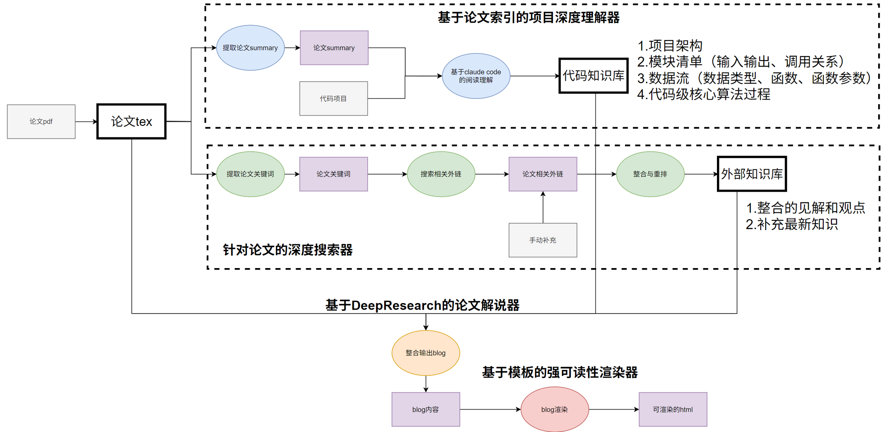
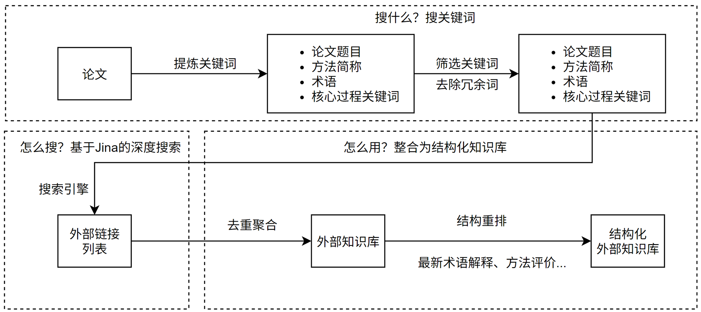
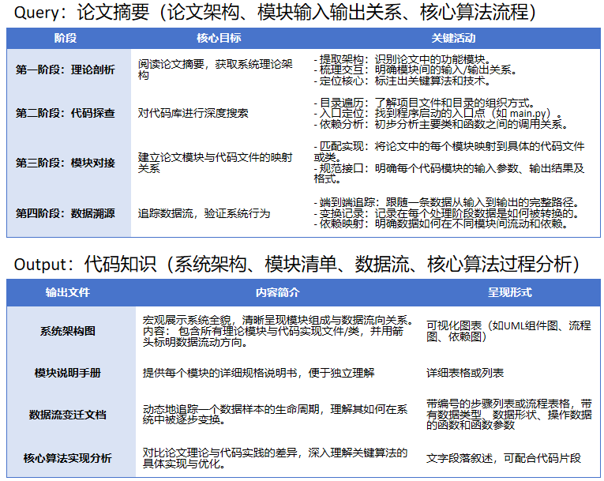
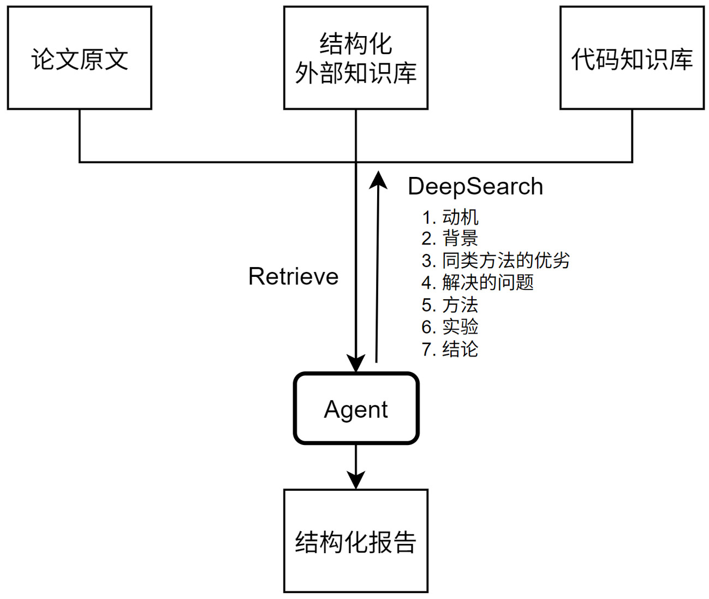
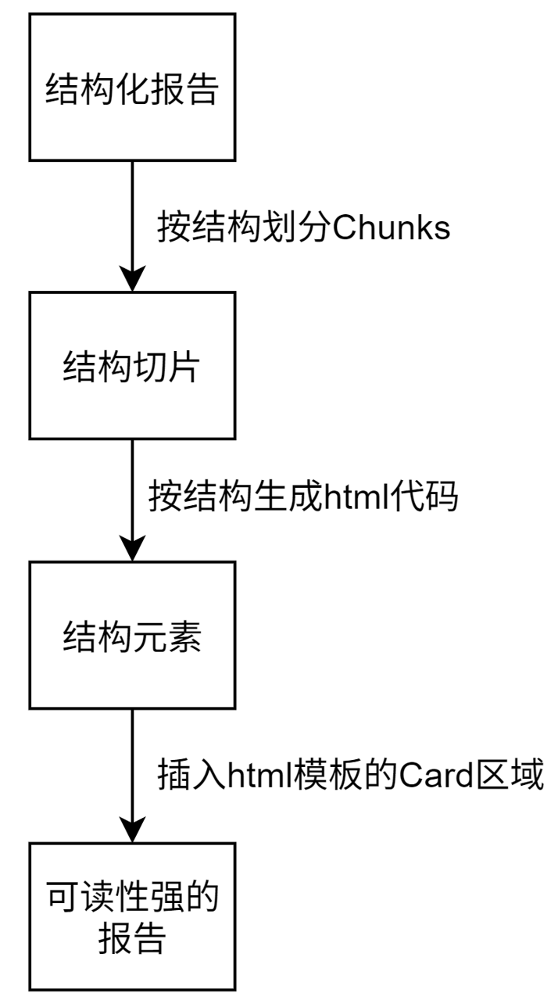

# FastPaperReader ———— 帮你更快读懂论文

**FastPaperReader** 是一款提升论文阅读效率的工具。它通过 **论文深度搜索器 + 项目深度理解器** 的双路并行架构，构建 **论文知识库** 与 **代码知识库**，并基于 **DeepResearch** 生成信息更完整的结构化论文报告，最终由 **强可读性渲染器** 输出美观的 HTML 页面，显著优化阅读体验。

## ✨ 功能特性

- 📄 **PDF论文处理** - 支持PDF下载、项目克隆、高质量PDF2TEX转换
- 🔗 **智能链接提取** - 自动从PDF中提取代码仓库链接和相关资源
- 🔀 **双路并行处理** - 论文深度搜索器 + 项目深度理解器同时工作，构建论文知识库和代码知识库
- 🧠 **DeepResearch驱动** - 融合论文、外部知识库、代码知识库的智能分析，生成包含7个标准模块的专业论文解读报告
- 🎨 **强可读性渲染** - 基于模板的HTML渲染，提供优秀的阅读体验
- 🤖 **多AI集成** - Deepseek论文理解 + Claude Code代码分析的协同工作
- 🎯 **Gradio界面** - 基于Gradio的交互式Web界面，支持步骤化处理和实时进度显示

## 🏗️ 系统架构



### 核心处理流程
```
项目初始化 → 资源下载 → PDF转TEX → 双路处理 → 结构化报告生成 → HTML渲染
                                    ↙        ↘
                            外部知识库      代码知识库
                            (论文深度搜索)  (项目深度理解)
                                    ↘        ↙
                                  DeepResearch论文解说器
```

### 双路处理系统
PDF转TEX后系统分为两路并行处理：

#### 路径1：针对论文的深度搜索器

- 基于论文内容进行深度知识搜索
- 构建外部知识库，补充相关背景信息
- 提供学术背景和相关工作支撑

#### 路径2：基于论文索引的项目深度理解器  

- 基于论文索引分析对应代码项目
- 生成代码知识库，深入理解实现细节
- 提供方法论与实现的对应关系

### 智能报告生成
#### DeepResearch论文解说器

融合**论文TEX + 外部知识库 + 代码知识库**，生成包含7个标准模块的结构化报告

#### 强可读性渲染器

使用基于模板的渲染引擎，生成美观的HTML页面

### 报告的7个标准输出模块
1. **动机** (Motivation)
2. **背景** (Background)
3. **同类方法的缺陷** (Limitations of Existing Methods)
4. **解决的问题** (Problem Solved)
5. **方法** (Methodology)
6. **实验** (Experiments)
7. **结论** (Conclusion)

## 🚀 快速开始

### 环境要求
- Python 3.11+
- OpenAI API Key
- PDFDeal API Key (用于PDF转TEX)
- Claude Code (可选，用于代码分析)

### 安装步骤

1. **克隆项目**
```bash
git clone <repository-url>
cd readpaperWithCode
```

2. **安装依赖**
```bash
pip install -r requirements.txt
```

3. **配置环境变量**
```bash
# 复制环境变量模板
cp .env.example .env

# 编辑 .env 文件，添加你的配置
OPENAI_API_KEY=your_openai_api_key_here
PDFDEAL_API_KEY=your_pdfdeal_api_key_here
HOST=0.0.0.0
PORT=8000
DEBUG=true
```

**获取API密钥：**
- [OpenAI API Key](https://platform.openai.com/api-keys) - 用于论文分析
- [Claude Code](https://claude.ai/) - 用于代码分析（可选）
- [PDFDeal API Key](https://noedgeai.github.io/pdfdeal-docs/) - 用于PDF转TEX转换

4. **启动应用**
```bash
python gradio_app.py
```

5. **访问应用**
启动后Gradio会自动打开浏览器，或手动访问显示的本地URL（通常是 `http://127.0.0.1:7860`）

## 📱 使用方法

### 智能双路处理界面
系统采用**双路并行处理**模式，用户可以逐步执行智能分析流程：

#### 步骤1：项目初始化
- 输入PDF链接（必需）
- 输入Git仓库链接（可选）
- 点击"🚀 创建项目"按钮

#### 步骤2：资源下载
- 点击"📄 下载PDF"下载论文文件
- 点击"💻 克隆代码"克隆Git仓库（如果提供）

#### 步骤3：PDF转TEX转换
- 点击"🔄 转换PDF"将PDF转换为高质量TEX格式
- 系统会自动提取Git链接和相关资源

#### 步骤4：知识库管理
- 点击"🔍 自动搜索"通过web search引擎搜索相关论文
- 手动添加/删除知识库链接

#### 步骤5：代码分析
- 点击"🔬 分析代码"对代码仓库进行深度分析
- 基于论文索引理解项目结构和实现细节

#### 步骤6：论文理解
- 点击"📖 理解论文"生成AI驱动的论文分析
- 融合论文内容、外部知识库和代码分析结果

#### 步骤7：生成Blog
- 点击"🎨 生成Blog"创建最终的结构化输出
- 生成包含7个标准模块的专业论文解读报告

#### 步骤8：HTML渲染
- 点击"📄 渲染HTML"生成美观的HTML页面
- 在界面中直接预览或下载HTML文件
- 提供优秀的阅读体验

### 特色功能
- **状态追踪**: 实时显示处理进度和结果
- **灵活执行**: 每个步骤都可以独立执行
- **错误处理**: 友好的错误提示和重试机制
- **文件管理**: 自动保存中间结果，支持文件下载

## 🛠️ 技术栈

### 核心技术
- **Python 3.11+** - 主要开发语言
- **requests** - HTTP请求处理
- **Gradio** - 交互式Web界面框架
- **dotenv** - 环境变量管理

### 数据下载和处理
- **PDFDeal** - 高质量PDF转TEX转换
- **GitPython** - Git仓库操作

### AI/ML集成
- **OpenAI / DeepSeek API** - 论文分析
- **Claude Code** - 代码分析
- **FastGPT** - 工作流搭建框架
- **Nija** - DeepSearch引擎

### 文档处理
- **Jinja2** - 构建HTML模板
- **Mermaid.js** - 流程图渲染

## 📁 项目结构

```
readpaperWithCode/
├── gradio_app.py               # Gradio主应用入口
├── src/
│   ├── core/                   # 核心业务逻辑
│   │   ├── __init__.py
│   │   ├── pipeline.py         # 步骤化处理管道
│   │   └── project_state.py    # 项目状态管理
│   ├── processors/             # 保留现有处理器
│   │   ├── __init__.py
│   │   ├── pdf_processor.py    # PDF处理(已实现)
│   │   ├── git_processor.py    # Git处理
│   │   └── mcp_processor.py    # MCP处理分析
│   ├── templates/              # HTML模板(简化)
│   │   ├── blog.html           # Blog展示模板
│   │   └── components/         # 组件模板
│   └── utils/                  # 工具函数
│       ├── __init__.py
│       ├── file_utils.py
│       └── text_utils.py
├── temp/                       # 临时文件目录
├── demo_pdf.py                 # 保留测试文件
├── requirements.txt            # Python依赖(添加gradio)
├── config.py                   # 配置文件(已存在)
├── .env.example               # 环境变量模板(已存在)
└── README.md                  # 使用说明
```

## ⚙️ 配置说明

### 环境变量

| 变量名 | 说明 | 默认值 |
|--------|------|--------|
| `OPENAI_API_KEY` | OpenAI API密钥 | 必需 |
| `PDFDEAL_API_KEY` | PDFDeal API密钥 | 必需 |
| `SERVER_GET_KEYWORD` | 获取关键字url mcp 服务 | 必需 |
| `SERVER_SEARCH_LINK` |  huoq website搜索链接| 必需 |
| `SERVER_SUMMARY` | 获取摘要mcp服务 | 必需 |
| `SERVER_KNOWLEDGE` | 获取知识库mcp服务 | 必需 |
| `SERVER_GEN_BLOG` | 生成摘要mcp服务 | 必需 |
| `TEMP_DIR` | 临时文件目录 | `temp/` |
| `DEBUG` | 调试模式 | `true` |
| `CLAUDE_CODE_COMMAND` | Claude Code命令 | `claude -p` |

## 🤝 贡献指南

1. Fork 本仓库
2. 创建功能分支 (`git checkout -b feature/AmazingFeature`)
3. 提交更改 (`git commit -m 'Add some AmazingFeature'`)
4. 推送到分支 (`git push origin feature/AmazingFeature`)
5. 打开 Pull Request

## 📄 许可证

本项目采用 MIT 许可证 - 查看 [LICENSE](LICENSE) 文件了解详情

## 🐛 问题反馈

如果遇到问题或有建议，请在 [Issues](../../issues) 页面提交
